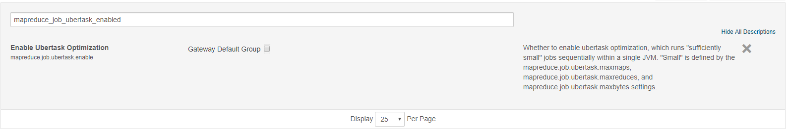
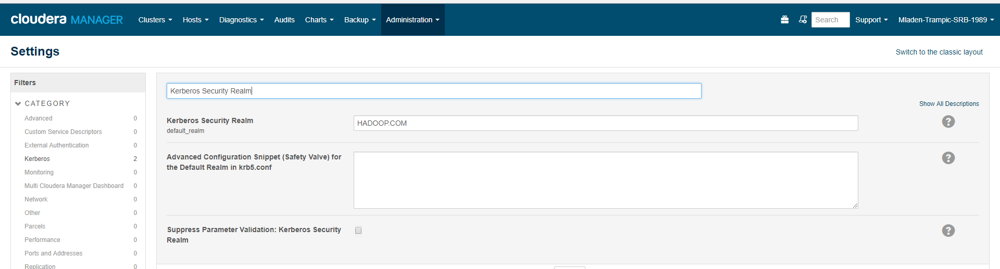
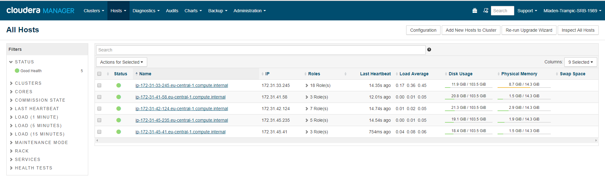
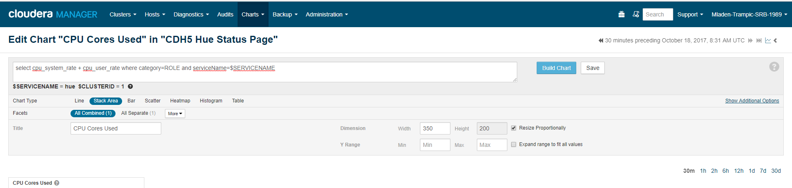
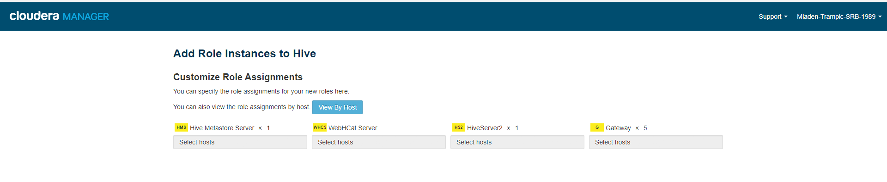
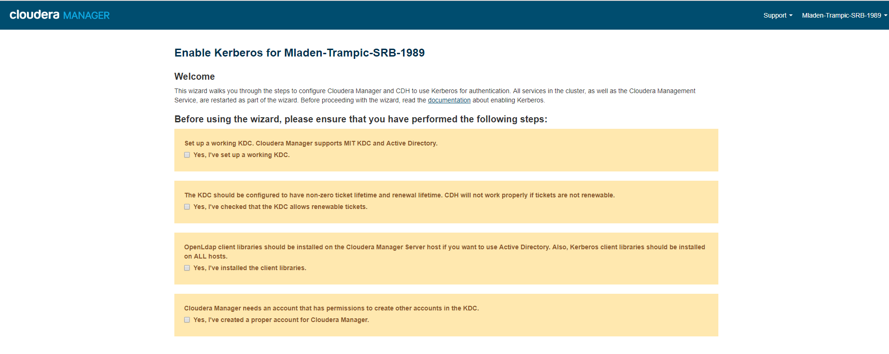

* What is ubertask optimization?
  
  
  
* Where in CM is the Kerberos Security Realm value displayed?

  

* Which CDH service(s) host a property for enabling Kerberos authentication?

  Cloudera Manager Server, Cloudera Manager Agents
  
* How do you upgrade the CM agents?

  

* Give the `tsquery` statement used to chart Hue's CPU utilization?

  

* Name all the roles that make up the Hive service

  

* What steps must be completed before integrating Cloudera Manager with Kerberos?

  